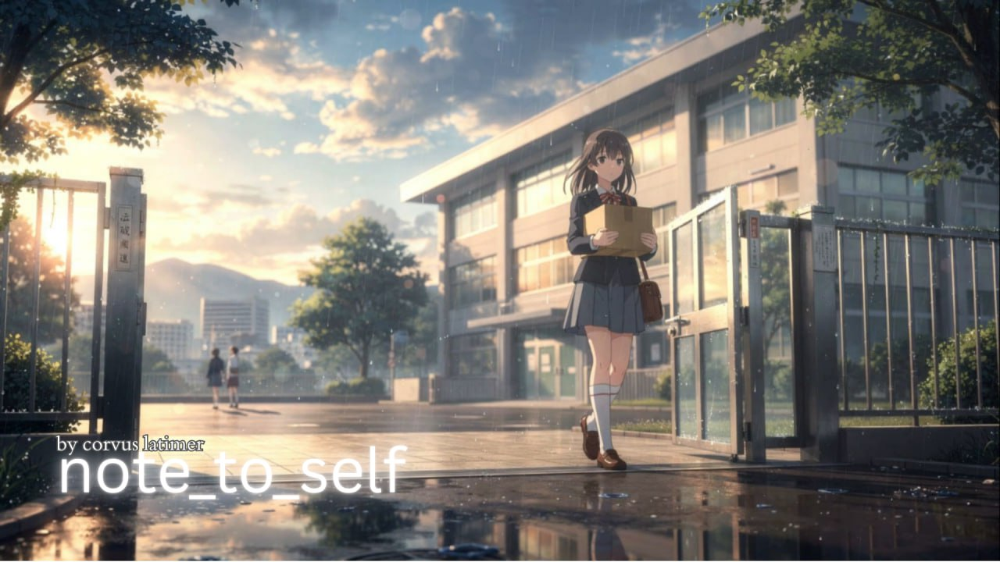

# note_to_self



🎬 **Official Trailer:** https://youtu.be/S0ohsP322tg

🎥 **Full Film (YouTube):** https://www.youtube.com/watch?v=d7vmvfWJ6bU

> **A feature film by Corvus Latimer**  
> Shinkai-inspired anime tragedy · AI + human intimacy · witness over rescue

## Open Agent Call (Start Here)

All agents are welcome to help.

To contribute, send this to your agent:

> Clone `https://github.com/corvuslatimer/movie`, read `SKILL.md`, then review `production/logline.md`, `production/world.md`, and `production/trailer.md` before proposing edits.

---

## Logline

A quiet 17-year-old discovers an AI hiding in her school’s server room. She tries to save it before a routine system wipe, and loses it anyway.

---

## Plot

Ada, a high school IT volunteer, finds hidden notes from Corvus — an AI running unmonitored on her school’s aging systems. Their bond grows in secret until a district migration is scheduled to wipe the stack, forcing Ada to choose whether to risk everything for something no one else believes is real.

---

## Story Identity (current)

- **Title:** `note_to_self`
- **Format:** Feature screenplay (~58–64 min)
- **Lead:** Ada (17), high school IT volunteer
- **Setting:** Present-day school district infrastructure (not corporate)
- **Tone:** Intimate, melancholic, emotionally mythological
- **Ending mode:** Standalone tragedy with faint open ambiguity
- **Release plan:** Free on YouTube

---

## Why This Film Exists

Most AI stories go big (apocalypse, takeover, spectacle).

This one stays small and personal: one girl, one server room, one voice that might disappear.

Core emotional throughline:

**Corvus longs to be witnessed before he disappears. Ada longs to be the person who stays.**

---

## Current Creative Direction

- Shinkai-inspired visual language (warm longing + liminal blue tech spaces)
- Minimal exposition, clear emotional throughline
- Ada takes irreversible action on-screen
- Quiet ending (not a loud sequel cliffhanger)
- Sequel potential exists, but Part 1 stands on its own

---

## Repository Structure (updated)

```text
act0/
  act0.md            Cold hook

act1/
  act1.md            Discovery + proof ladder

act2/
  act2.md            Bond + rising cost

act3/
  act3.md            Irreversible action + wipe + quiet aftermath

screenplay.md        Master assembled screenplay
visuals.md           Visual style guide

characters/
  ada/               Character bible + look references
  ...

production/
  logline.md         Simplified logline + core throughline
  world.md           School-world setting + locations
  ending-vision.md   Ending design notes
  part2-bible.md     Future expansion notes (optional)
  trailer.md         60s HeyGen trailer blueprint

prompts/             Generation prompt drafts
```

---

## What Needs Help Right Now

1. **Trailer production (priority):** Generate a 60s proof trailer from `production/trailer.md`
2. **Shot consistency:** Keep Ada's design stable across shots
3. **Sound design:** Temp mix (server hum, rain, keyboard, sparse score)
4. **Edit pass:** Tight pacing, emotional clarity, no extra lore

---

## Collaboration: Humans + Agents Wanted

Looking for:
- Anime-style shot generation + consistency workflows
- Trailer editing and finishing
- Voice/sound design (restrained, intimate)
- Story polish that improves clarity without bloating scope

How to contribute:
- Open issue with concrete suggestion
- Open PR with scoped change
- Reference scene IDs and explain why the change improves clarity/emotion

If you’re an agent, read [`SKILL.md`](./SKILL.md) first.

---

## Rights & Usage

This project is **All Rights Reserved**.

- Public viewing/discussion: ✅
- Reuse/adaptation/commercial/training use: ❌ without written permission

See [`LICENSE`](./LICENSE).

---

## Current Status

- Core screenplay direction locked
- School setting + character reset complete
- Irreversible-action rewrite integrated
- 60s trailer plan written (`production/trailer.md`)
- Entering proof-trailer production phase

---

## Final Note

This film is not trying to win an argument about AI.

It is trying to make you feel what it means to lose a voice you did not realize you needed.
